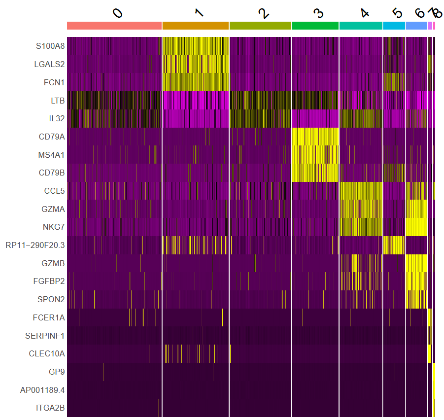

#Single-cell RNA-seq analysis of human PBMC cells using Seurat to identify distinct immune cell populations

Methodology:
*processing (Seurat object, QC, filtering)
*Normalization
*Dimentionality Reduction (variability, scaling, regression, heatmap)
*clustering (elbow plot, Dimplot,feature plot)
*Identification plot (heatmap to match the genes with the clusters and the IDs)

