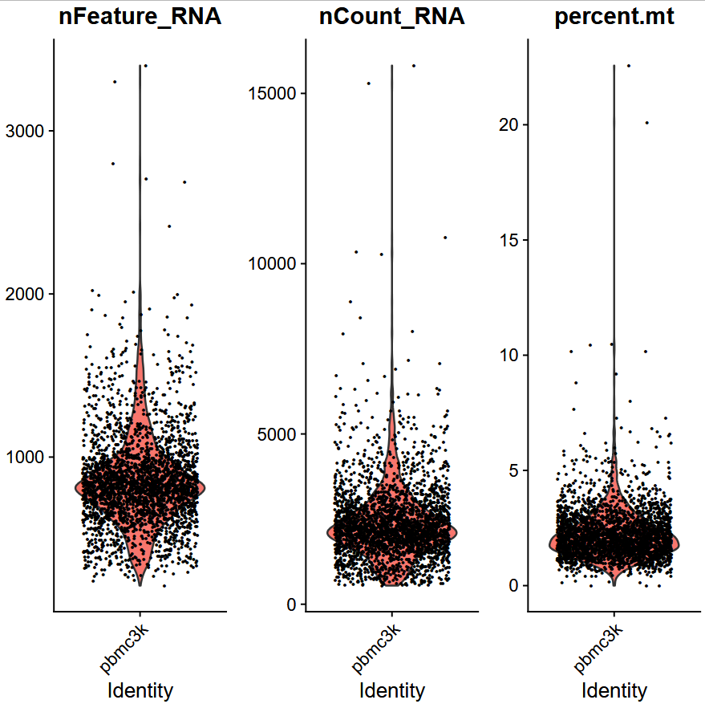
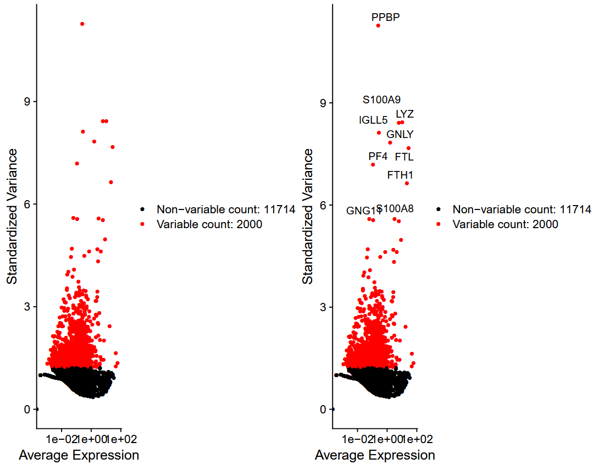

#Single-cell RNA-seq analysis of human PBMC cells using Seurat to identify distinct immune cell populations

Methodology:
*processing (Seurat object, QC, filtering)
*Normalization
*Dimentionality Reduction (variability, scaling, regression, heatmap)
*clustering (elbow plot, Dimplot,feature plot)
*Identification plot (heatmap to match the genes with the clusters and the IDs)

Figure 1: nFeature_RNA, nCount_RNA, mitochondrial %. 
First look to identify the potential outliers and the filtering.

Figure 2: Standardized variance 
Genes with high average expression 

Figure 3: Heatmap with the 3 mostly expressed genes from each cluster. 
The highly expressed genes from each clusters are the markers we use in order to identify the clusterID. 

Figure 4: Cell clusters and identification. 

